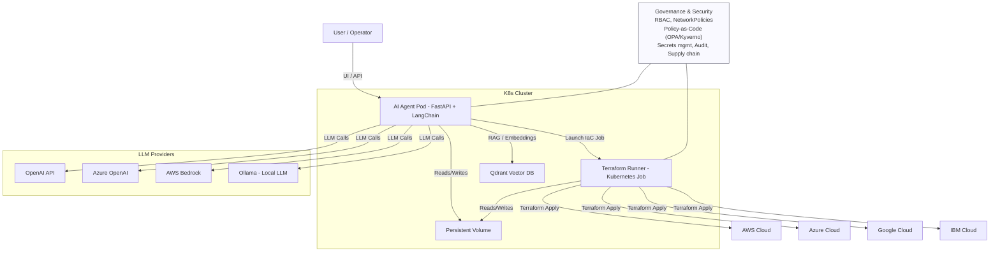
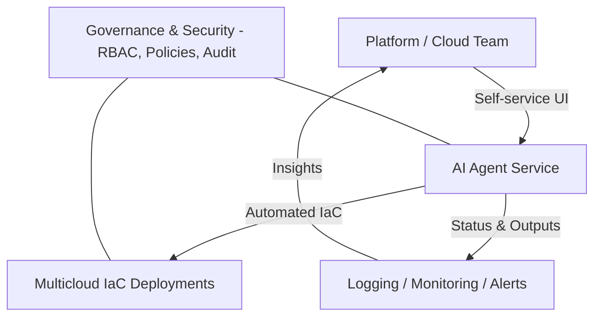

# RAG‑Powered Multicloud IaC Agent on Kubernetes | Validated on Rancher (On‑Prem) & AWS EKS (EFS/EBS/ALB/LB/DNS)

This project delivers a RAG-enabled AI Agent that automates IaC resource deployments across AWS, Azure, Google Cloud, and IBM Cloud using Terraform and Kubernetes.

## What the Agent Does (At a Glance)
- Document RAG (your data): Upload your own documents (e.g., PDF/TXT). The agent chunks, embeds, and indexes them in Qdrant, then answers queries grounded in your private knowledge base.
- LLM‑only search (general knowledge): Query the selected LLM provider (OpenAI, Azure OpenAI, AWS Bedrock, or Ollama) without using your uploaded documents.
- Multicloud IaC execution: From the UI, the agent can parameterize and launch Terraform jobs to provision infrastructure resources across AWS, Azure, Google Cloud, or IBM Cloud. Job status and logs are viewable in the UI.
- Mode selection: Switch between RAG (custom docs) and LLM‑only (general model knowledge) directly in the UI before asking or deploying.

Validated on:
- Rancher (on‑prem Kubernetes)
- AWS EKS with EFS (RWX), EBS gp3 (RWO), AWS Load Balancer Controller (ALB), Service type LoadBalancer, and DNS (Route 53 or external DNS)

---

## Table of Contents
- [🚀 Key Capabilities](#-key-capabilities)
- [🧰 Technology Stack](#-technology-stack)
- [✅ Validated Platforms](#-validated-platforms)
- [📦 Codebase Overview (Available on Request)](#-codebase-overview-available-on-request)
- [🐳 Container Images](#-container-images)
- [⚙️ Getting Started](#️-getting-started)
- [🔌 API Capabilities & UI Integration](#-api-capabilities--ui-integration)
- [🛡 Governance, Security, and Compliance](#-governance-security-and-compliance)
- [🧭 AI Governance Add‑ons: Evidently AI & MLflow](#-ai-governance-add-ons-evidently-ai--mlflow)
- [🗂️ Architecture](#️-architecture)
- [📝 Additional Notes](#-additional-notes)
- [🛣 Roadmap](#-roadmap)

---

## 🚀 Key Capabilities
- RAG over your custom documents (upload → chunk → embed → index in Qdrant → grounded answers)
- LLM‑only search against the model’s general knowledge (no private docs)
- Terraform‑driven multicloud IaC deployments (AWS/Azure/GCP/IBM) initiated from the UI, with live job logs
- Kubernetes‑native packaging and orchestration (Helm)
- LLM provider agnostic: OpenAI, Azure OpenAI, AWS Bedrock, or local Ollama

---

## 🧰 Technology Stack
- Language: Python 3.11
- LLM: OpenAI API, Azure OpenAI, AWS Bedrock, Ollama
- Vector DB: Qdrant
- IaC: Terraform
- Platforms: AWS, Azure, Google Cloud, IBM Cloud
- Orchestration: Kubernetes, Helm
- Governance/Security: RBAC, NetworkPolicies, OPA/Gatekeeper or Kyverno, image scanning/SBOM, audit logging
- Tooling: Docker, VS Code, GitHub

---

## ✅ Validated Platforms
- Rancher (on‑prem): NFS-backed PVCs, ClusterIP/NodePort/Ingress
- AWS EKS:
  - Storage: EFS (RWX), EBS gp3 (RWO)
  - Networking: AWS Load Balancer Controller (ALB), Service type LoadBalancer
  - DNS: Route 53 (or external DNS)
  - NodePort and Ingress supported

---

## 📦 Codebase Overview (Available on Request)
A detailed repository tree, module mapping, and file-level descriptions are available upon request.  
This README omits the full structure for brevity and to avoid exposing internal layout in public mirrors.

---

## 🐳 Container Images

### 1) Agent Image
- Dockerfile: docker/rag/Dockerfile
- Purpose: FastAPI app, LLM/RAG logic
- Build:
```sh
docker build -t <dockerhub-user>/ai-agent-rag:1.0.0 -f docker/rag/Dockerfile .
```

### 2) Terraform Runner Image
- Dockerfile: docker/tf_runner/Dockerfile
- Purpose: Executes Terraform inside a Kubernetes Job
- Build:
```sh
docker build -t <dockerhub-user>/ai-agent-tf-runner:1.0.0 -f docker/tf_runner/Dockerfile .
```

### Push
```sh
docker push <dockerhub-user>/ai-agent-rag:1.0.0
docker push <dockerhub-user>/ai-agent-tf-runner:1.0.0
```

---

## ⚙️ Getting Started

### 1) Prerequisites
- Kubernetes cluster and StorageClass:
  - EKS: EBS gp3 (RWO), EFS (RWX) as needed
  - GKE/AKS/Rancher: standard/managed-premium/NFS equivalents
- Docker registry access
- Terraform CLI in the runner image
- Helm 3.x
- Credentials for your chosen LLM provider(s) and cloud(s)

### 2) Configure Helm Values
Edit helm-chart/values.yaml:
- agentName, image repositories/tags (agent and runner)
- Secrets (choose what applies):
  - LLM: OPENAI_API_KEY, AZURE_OPENAI_ENDPOINT/KEY, AWS_* for Bedrock, OLLAMA_BASE_URL
  - Qdrant: QDRANT_HOST/PORT/COLLECTION
  - Cloud creds: AWS_ACCESS_KEY_ID/AWS_SECRET_ACCESS_KEY, AZURE_*, GCP service account, IBM Cloud key
- Service (ClusterIP/LoadBalancer) or Ingress/ALB, PVC StorageClass

Example:
```yaml
image:
  repository: "<dockerhub-user>/ai-agent-rag"
  tag: "1.0.0"
runnerImage:
  repository: "<dockerhub-user>/ai-agent-tf-runner"
  tag: "1.0.0"

secrets:
  OPENAI_API_KEY: "<openai-key>"
  AZURE_OPENAI_ENDPOINT: "<https-endpoint>"
  AZURE_OPENAI_API_KEY: "<azure-key>"
  AWS_REGION: "us-east-1"
  AWS_ACCESS_KEY_ID: "<aws-akid>"
  AWS_SECRET_ACCESS_KEY: "<aws-secret>"
  OLLAMA_BASE_URL: "http://ollama:11434"

  QDRANT_HOST: "<qdrant-service-or-host>"
  QDRANT_PORT: "6333"
  QDRANT_COLLECTION: "rag_docs"

  # Optional per-cloud IaC credentials
  GCP_PROJECT: "<gcp-project>"
  GOOGLE_APPLICATION_CREDENTIALS_JSON: "<base64-or-mounted-secret>"
  IBMCLOUD_API_KEY: "<ibmcloud-api-key>"
```

### 3) Deploy to Kubernetes
```sh
cd helm-chart
helm upgrade --install <release> . -n <namespace> --create-namespace
```

### 4) Provide Application Source
If a PVC is mounted at /app/src, ensure src/ content is present (or bake into the image):
```sh
kubectl cp src/. <namespace>/<pod-name>:/app/src -n <namespace>
kubectl exec -n <namespace> <pod-name> -- chmod +x /app/src/run_terraform.sh
```

### 5) Access the UI and API
- NodePort/LoadBalancer/ALB/Ingress as available
- API docs:
  - /docs (Swagger UI)
  - /redoc
  - /openapi.json

---

## 🔌 API Capabilities & UI Integration
The agent exposes a RESTful JSON API that can be embedded in any GUI/UI (React, Vue, Angular, Svelte, Flutter, native apps) or used from automation and chatbots.

- Discovery
  - OpenAPI (Swagger): /docs
  - ReDoc: /redoc
  - Spec JSON: /openapi.json
  - Health: /healthz

- Core endpoints
  - RAG query (uploaded docs): GET /query?q=... (returns grounded answer + sources)
  - Document upload: POST /upload (multipart/form-data)
  - IaC deploy (Terraform job): POST /deploy/sap (generic IaC job launcher; renameable)
  - IaC logs: GET /deploy/logs/{job_name}
  - UI root: GET /

- Integration patterns
  - Any frontend can call the API directly. Example (browser):
    ```js
    // RAG query
    const res = await fetch('/query?q=' + encodeURIComponent('What VPC was created?'));
    const data = await res.json();
    // IaC deploy
    await fetch('/deploy/sap', {
      method: 'POST',
      headers: { 'Content-Type': 'application/json' },
      body: JSON.stringify({ cloud: 'aws', region: 'us-east-1', vpc_name: 'demo' })
    });
    ```
  - Example (curl):
    ```bash
    curl -s "http://<host>/query?q=List resources"
    curl -s -X POST "http://<host>/deploy/sap" -H "Content-Type: application/json" \
      -d '{"cloud":"azure","resource_group":"rg-demo"}'
    curl -s "http://<host>/deploy/logs/<job_name>"
    ```

- CORS and auth
  - CORS can be enabled in FastAPI to allow external UIs.
  - The API can sit behind an Ingress/ALB, API Gateway, or Cloudflare for TLS and auth.
  - Add API key/JWT/OIDC at the gateway or app layer as required.

- Long‑running jobs
  - Deploy requests return a job identifier (job_name). UIs can poll /deploy/logs/{job_name} or stream logs to show progress.

This design keeps the backend UI‑agnostic and easy to embed in portals, consoles, and custom dashboards.

---

## 🛡 Governance, Security, and Compliance
- Secrets & Key Management
  - Kubernetes Secrets (optionally Sealed Secrets or External Secrets)
  - No secrets in source control; use CI/CD secret stores
- Access Control & Isolation
  - RBAC (least privilege), namespace isolation
  - Pod Security (baseline/restricted), NetworkPolicies
- Policy-as-Code
  - OPA/Gatekeeper or Kyverno for admission policies (images, privilege, labels)
- Supply Chain Security
  - Image signing/verification (Cosign), SBOM, vulnerability scanning in CI
- Auditability & Logging
  - API server audit logs, Job/Pod logs persisted and redacted
- Data Protection
  - Encrypt at rest (EBS/EFS/GCE PD/Azure Disk), TLS in transit (Ingress)
- LLM Guardrails
  - Safe prompts, size limits, PII minimization
  - Provider-side safety settings where available

## 🧭 AI Governance Add‑ons: Evidently AI & MLflow
Add optional, vendor‑neutral governance to observe quality, drift, and operational metrics for RAG and IaC runs.

- Evidently AI (What it is)
  - Open‑source monitoring for ML/data quality and drift detection, with batch reports or a lightweight service.
- Evidently AI (How we use it here)
  - Monitor RAG inputs/outputs:
    - Query distribution and drift (e.g., topics, length, language).
    - Embedding distributions (vector norms/stats) and drift over time.
    - Response quality signals (latency, error rate, citation coverage ratio, user feedback thumbs up/down).
  - Generate periodic batch HTML reports from interaction logs, or push metrics to an Evidently service endpoint for dashboards.
- MLflow (What it is)
  - Open‑source experiment tracking, metrics logging, artifact storage, and model registry.
- MLflow (How we use it here)
  - Track LLM/RAG runs and IaC jobs:
    - Params: provider (OpenAI/Azure/Bedrock/Ollama), model IDs, temperature/top_p, embedding model, top‑k, prompt template version.
    - Metrics: latency, token usage/cost (if available), hit@k, response length, success/error, job duration.
    - Artifacts: prompts, responses, retrieved chunks/sources, IaC plan/apply logs.
  - Use the MLflow Model Registry to version “agent policies” (prompt templates + retrieval configs).

Optional configuration (Helm values/env) to enable integrations:
```yaml
# values.yaml (example)
governance:
  enabled: true
  mlflow:
    enabled: true
    trackingUri: "http://mlflow-server:5000"
    experimentName: "k8s-ai-agent"
  evidently:
    enabled: true
    mode: "reports"           # "reports" (batch HTML) or "service"
    endpoint: "http://evidently:8000"  # required if mode=service
```

Kubernetes deployment env (example):
```yaml
# Deployment env snippet
- name: GOVERNANCE_ENABLED
  value: "true"
- name: MLFLOW_TRACKING_URI
  valueFrom:
    configMapKeyRef:
      name: {{ .Values.agentName }}-config
      key: mlflow.trackingUri
- name: MLFLOW_EXPERIMENT_NAME
  valueFrom:
    configMapKeyRef:
      name: {{ .Values.agentName }}-config
      key: mlflow.experimentName
- name: EVIDENTLY_MODE
  valueFrom:
    configMapKeyRef:
      name: {{ .Values.agentName }}-config
      key: evidently.mode
- name: EVIDENTLY_ENDPOINT
  valueFrom:
    configMapKeyRef:
      name: {{ .Values.agentName }}-config
      key: evidently.endpoint
```

Minimal code hooks (illustrative):
```python
# Log a run to MLflow (pseudo)
import mlflow
mlflow.set_tracking_uri(os.getenv("MLFLOW_TRACKING_URI", ""))
mlflow.set_experiment(os.getenv("MLFLOW_EXPERIMENT_NAME", "k8s-ai-agent"))
with mlflow.start_run(run_name="rag_query"):
    mlflow.log_params({"provider": provider, "model": model, "top_k": top_k})
    mlflow.log_metrics({"latency_ms": latency, "tokens": tokens})
    mlflow.log_text(prompt, "artifacts/prompt.txt")
    mlflow.log_text(response_text, "artifacts/response.txt")

# Generate Evidently batch report (pseudo)
from evidently.report import Report
from evidently.metrics import DataDriftPreset, ColumnDriftMetric
report = Report(metrics=[DataDriftPreset()])
report.run(reference_data=ref_df, current_data=curr_df)
report.save_html("/app/src/jobs/evidently_report.html")
```

Deployment options
- MLflow: run the MLflow Tracking Server on K8s with a backend DB (e.g., Postgres) and S3/MinIO artifact store, or use a managed MLflow.
- Evidently: run the Evidently service in‑cluster, or schedule batch jobs (CronJob) to produce HTML reports and publish them behind your Ingress.

Privacy & scope
- Only non‑sensitive telemetry should be logged by default (redact secrets, keys, PII). Align with your internal policies before enabling.

---

## 🗂️ Architecture

### 1) Technical Architecture (Multicloud IaC)


### 2) Business/Managerial View


---

## 📝 Additional Notes
- Choose one or multiple LLM providers; switch via env/Helm values.
- Configure Terraform backends/state and cloud credentials per provider best practices.
- Qdrant can be replaced with another vector DB if desired.

---

## 🛣 Roadmap
1. Core Agent + RAG for knowledge queries
2. Provider-agnostic IaC modules and parameterization
3. Pluggable LLM provider selection at runtime
4. Advanced observability and job orchestration
5. Optional: additional vector DB backends and secret